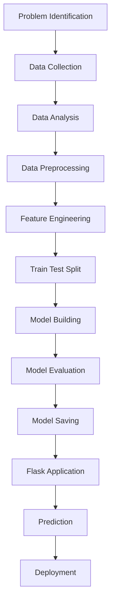
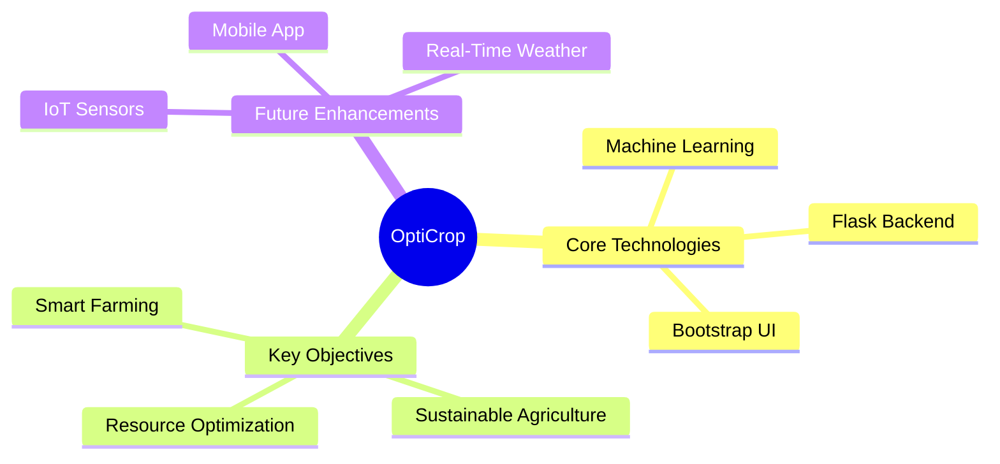

# OPTICROP: SMART AGRICULTURAL PRODUCTION OPTIMIZATION USING MACHINE LEARNING
## Project Documentation for Bachelor of Technology (B.Tech) final year project submission

---

# EPIC 1: DEFINE PROBLEM AND UNDERSTANDING

## 1. Business Problem

Modern agriculture stands at a critical crossroads where traditional farming practices are no longer sufficient to meet the challenges of the twenty-first century. Farmers worldwide face unprecedented difficulties due to erratic weather patterns, declining soil fertility, and depleting water resources. A primary driver of agricultural inefficiency is the lack of scientific guidance in crop selection. For generations, cultivation decisions have been based on historical habits, localized folklore, or immediate market price trends, rather than empirical soil and environmental metrics. Consequently, farmers frequently cultivate crops that are ill-suited to their soil’s chemical composition and regional climate, resulting in suboptimal yields, financial distress, and in severe cases, complete crop failure.

This misalignment in crop selection propagates several compounding challenges. Soil nutrient degradation is a major consequence, where continuous cultivation of the same crop depletes specific macronutrients—primarily Nitrogen (N), Phosphorous (P), and Potassium (K)—leading to severe soil nutrient imbalances. To compensate, farmers often resort to the excessive and unscientific application of chemical fertilizers, which degrades soil structure, increases cultivation costs, and pollutes local water sources through chemical runoff. Furthermore, water utilization becomes highly inefficient. Cultivating water-intensive crops in low-rainfall zones drains local groundwater reserves, while dry-land crops grown in high-moisture zones suffer from root rot and fungal infections.

Climate uncertainty further exacerbates these agricultural vulnerabilities. Rapidly shifting temperature and rainfall patterns render traditional farming calendars obsolete. Without predictive insights, farmers cannot adjust their crop selections to match upcoming seasonal profiles. This combination of ecological and decision-making challenges highlights the urgent need for a shift toward precision agriculture. Integrating data-driven tools can replace guesswork with scientific recommendation, aligning crop selection with real-time soil and climatic parameters.

OptiCrop addresses these challenges by providing an intelligent, Web-based Crop Recommendation System. By analyzing critical macronutrients alongside ambient environmental parameters, the system helps farmers make informed, data-driven choices. This approach minimizes production risks, optimizes resource allocation, and assists agricultural stakeholders in transitioning from traditional, high-risk practices to predictable, high-yield smart farming.

---

## 2. Objectives

The primary objective of this project is to develop and deploy an intelligent, real-time crop recommendation system that leverages machine learning to match soil chemistry and environmental conditions with the most suitable crop types. By training models on historically validated agricultural data, the system aims to output highly accurate, localized crop predictions. The platform bridges the gap between complex data science and everyday farming by packaging predictive algorithms into an intuitive, responsive web-based interface that requires no technical expertise from the end user.

A key objective is the integration of multiple data streams to evaluate the suitability of a crop. Rather than relying on a single metric, OptiCrop synthesizes macronutrients (N, P, K), soil pH, temperature, relative humidity, and average rainfall. This holistic analysis ensures that recommendations are agriculturally sound and resilient to changing climatic parameters. The machine learning engine, built on Scikit-learn, uses classification algorithms to process these variables and generate instant predictions.

Another core focus of the project is resource optimization and sustainable agriculture. Providing precise recommendations helps farmers avoid the over-application of synthetic fertilizers, saving input costs and preserving soil ecology. Aligning crop water requirements with local rainfall and humidity patterns also promotes sustainable water management, reducing reliance on artificial irrigation and mitigating groundwater depletion.

Ultimately, OptiCrop aims to provide a scalable, accessible, and practical tool for precision farming. The system is designed to support farmers, agricultural extension officers, and agricultural cooperatives with data-driven decision tools. By reducing crop failure rates and increasing per-acre yields, the project contributes to local economic stability, regional food security, and environmental conservation.

---

## 3. Functional Requirements

The OptiCrop framework is structured around specific functional blocks that manage data flow from user input to final prediction. The first functional requirement is the User Input Interface, which collects agricultural parameters. The system provides an interactive HTML5/CSS3 web form built with Bootstrap to capture seven critical features: Nitrogen (N), Phosphorous (P), Potassium (K), ambient Temperature, relative Humidity, soil pH, and annual Rainfall. The interface validates inputs to prevent erroneous values—such as negative nutrient concentrations or pH levels outside the standard 0–14 scale—ensuring data integrity before submission.

Once input parameters are validated, the Flask backend processes the data. Flask acts as the routing controller, accepting HTTP POST requests from the web interface, extracting form values, and converting them into a structured numerical format suitable for model inference. The backend uses NumPy to format the input array into a two-dimensional structure matching the training dataset, then passes this vector to the serialized machine learning model.

The Machine Learning engine represents the analytical core of the application. It loads a pre-trained, serialized classification model using the Pickle library. This model evaluates the seven-dimensional input vector against its learned decision boundaries to predict the crop class with the highest probability. The prediction is returned to the Flask application layer as a string identifier, such as "rice", "maize", or "chickpea".

The final functional requirement is the presentation of the prediction to the user. Flask receives the predicted crop label and dynamically updates the result page using the Jinja2 templating engine. The interface displays the recommended crop alongside localized agricultural context, such as optimal growing conditions or basic cultivation guidelines. The entire transaction is designed to execute with low latency, providing immediate recommendations upon form submission.

---

## 4. Literature Survey

Precision agriculture and data-driven crop recommendation have been active areas of study in agricultural engineering and computer science. Early implementations of agricultural advisory systems relied on Rule-Based Expert Systems. These systems used hardcoded threshold values defined by agricultural scientists to suggest crops. While useful, these expert systems lacked adaptability, struggled with non-linear parameter relationships, and required manual adjustments for different geographical microclimates.

Recent research has focused on applying machine learning algorithms to model complex soil and environmental interactions. Scholars have investigated supervised learning models like Naive Bayes, Decision Trees, Random Forests, Support Vector Machines (SVM), and Logistic Regression for crop classification. Studies show that ensemble methods and linear models with regularized decision boundaries perform well on tabular soil datasets, showing high accuracy when classification inputs are properly normalized. Logistic Regression, in particular, has proven highly efficient for multi-class agricultural datasets, offering fast training, low execution latency, and clear probabilistic decision boundaries.

Researchers have also explored unsupervised learning techniques, such as K-Means and Hierarchical Clustering, to analyze agricultural data. Clustering helps group crops with similar nutrient profiles and water requirements, providing structural insights into agricultural datasets. These groupings help identify crops that can share crop rotation schedules, companion planting layouts, or irrigation infrastructure.

Despite these advancements, research gaps remain in the practical deployment of these models. Many academic studies focus on offline model metrics and do not deploy their systems as accessible applications. Farmers and local agricultural extension officers cannot easily run command-line Python scripts or Jupyter notebooks. OptiCrop addresses this gap by combining supervised Logistic Regression and unsupervised K-Means clustering into a unified web application using Flask, providing an accessible tool for field deployment.

---

## 5. Social Relevance

The development of OptiCrop is highly relevant to contemporary economic and environmental challenges, particularly for smallholder farming communities in developing countries. Agriculture remains a primary source of livelihood for a significant portion of the global population, yet farmers often operate with high vulnerability to crop failure. Providing an accessible tool for precise crop selection helps stabilize farm incomes, reduce seasonal debt cycles, and improve rural livelihoods.

By optimizing crop selection based on soil chemistry, the project promotes sustainable soil conservation. Farmers are advised to plant crops that naturally align with their soil's existing macronutrient levels, reducing the need for intensive chemical fertilization. This targeted approach prevents soil acidification, maintains microbial biodiversity, and avoids environmental degradation caused by excessive chemical runoff into local rivers and groundwater systems.

OptiCrop also addresses water conservation challenges. Matching crop recommendations with local rainfall and humidity metrics helps prevent the cultivation of water-intensive crops in arid zones. This optimization helps conserve surface water resources and reduces the energy required for deep-borewell groundwater extraction, supporting long-term water conservation goals.

At a macro level, the project supports food security and climate resilience. As climate change alters traditional temperature and rainfall patterns, OptiCrop provides farmers with real-time adaptations to shifting parameters. Deploying data-driven tools helps agricultural systems adapt to changing environmental conditions, securing food production lines and supporting sustainable agricultural development.

---

# EPIC 2: DATA COLLECTION AND ANALYSIS

## 1. Download Dataset

The analytical foundation of the OptiCrop system is the Crop Recommendation Dataset, sourced from the Kaggle repository. This dataset was selected because it contains historically validated, high-quality agricultural readings that map diverse environmental and soil conditions to specific successful crop yields. The data represents a compiled set of observations from agricultural test plots, capturing a wide variety of crop types across different soil types and climate profiles.

The dataset contains 2,200 individual rows, with each observation representing a unique agricultural profile. Each record consists of seven independent numerical features and one categorical target label representing the optimal crop. The target variable covers 22 distinct crop classes, including cereals (such as rice, maize, wheat, and finger millet), legumes (such as kidney beans, pigeon peas, moth beans, mung beans, blackgram, lentil, and chickpea), fruits (such as banana, mango, grapes, watermelon, muskmelon, apple, orange, and papaya), and cash crops (such as cotton, jute, and coffee).

This diverse classification structure allows the machine learning model to learn complex relationships across various agricultural categories. The uniform distribution of 100 samples per crop class ensures a balanced dataset. This balance prevents the model from developing a classification bias toward any single crop, a common issue in imbalanced datasets that can lead to skewed recommendations.

---

## 2. Import Libraries

Developing the OptiCrop model requires importing a suite of Python libraries, each handling a specific stage of the machine learning pipeline:

| Library / Module | Import Statement / Specific Functions | Primary Role in Project |
| :--- | :--- | :--- |
| **Pandas** | `import pandas as pd` | Structured data manipulation, CSV parsing, data filtering, and statistical exploration using DataFrames. |
| **NumPy** | `import numpy as np` | High-performance multi-dimensional array operations, matrix transformations, and numerical preprocessing. |
| **Matplotlib** | `import matplotlib.pyplot as plt` | Core plotting framework for rendering statistical graphs, distributions, and boundary curves. |
| **Seaborn** | `import seaborn as sns` | High-level statistical visualization interface for density estimations, scatter plots, and correlation heatmaps. |
| **IPython** | `from IPython.core.interactiveshell import InteractiveShell` | Configures the execution environment to print multiple cell outputs concurrently, streamlining interactive analysis. |
| **Scikit-learn** | `from sklearn.model_selection import train_test_split` | Partitions the dataset into independent training and validation subsets to ensure unbiased model evaluation. |
| **Scikit-learn** | `from sklearn.linear_model import LogisticRegression` | The core supervised algorithm utilized for multi-class crop prediction based on linear decision boundaries. |
| **Scikit-learn** | `from sklearn.cluster import KMeans` | Unsupervised algorithm used to identify structural clusters and group crops with similar ecological requirements. |
| **Scikit-learn** | `from sklearn.metrics import classification_report, confusion_matrix` | Evaluation utilities that compute precision, recall, F1-scores, and display classification error matrices. |
| **Pickle** | `import pickle` | Serializes the trained Python model object into a binary file format for web application integration. |

Pandas and NumPy form the data manipulation layer, converting raw CSV data into in-memory structures. Matplotlib and Seaborn constitute the visualization layer, allowing developers to inspect data distributions and identify patterns visually. Scikit-learn provides the machine learning components, offering robust implementations for clustering, classification, dataset splitting, and model evaluation metrics.

---

## 3. Read Dataset

The raw data is loaded into memory using the Pandas CSV parser, `pd.read_csv('Crop_recommendation.csv')`. This function processes the text-based comma-separated values into a structured two-dimensional Pandas DataFrame. This format allows for efficient index-based operations, vector queries, and descriptive statistical analysis.

Upon loading the dataset, the `head()` method is called to display the first five rows of data. This step allows for a quick inspection of the data structure, verifying that values are parsed correctly, data types align with expectations, and columns are properly aligned. It also provides an initial look at the scale and formatting of the agricultural metrics.

The dataset contains the following eight features:

*   **Nitrogen (N):** Ratio of Nitrogen content in the soil (mg/kg).
*   **Phosphorous (P):** Ratio of Phosphorous content in the soil (mg/kg).
*   **Potassium (K):** Ratio of Potassium content in the soil (mg/kg).
*   **Temperature:** Ambient air temperature in degrees Celsius (°C).
*   **Humidity:** Relative air humidity represented as a percentage (%).
*   **pH:** The logarithmic scale of soil acidity or alkalinity, ranging from 0 to 14.
*   **Rainfall:** Average annual precipitation measured in millimeters (mm).
*   **Label:** The target categorical string representing the recommended crop.

```python
# Conceptual representation of reading and inspecting the dataset
df = pd.read_csv('Crop_recommendation.csv')
print(df.head())
```

---

## 4. Univariate Analysis

Univariate analysis evaluates each soil and environmental feature individually to understand its underlying probability distribution. The primary tool for this analysis is Seaborn’s distribution plot (such as `sns.histplot` or `sns.kdeplot`), which maps the density of data points across a feature’s range. By plotting these features individually, we can identify skewness, locate mode values, and assess overall data spread.

Understanding these distributions is critical for selecting and preparing machine learning models. For instance, variables like temperature and pH typically show a symmetric, bell-shaped Gaussian distribution, indicating stable, natural bounds in the dataset. In contrast, features like rainfall and phosphorous may show multi-modal or skewed distributions, indicating distinct sub-populations within the data.

Evaluating these single-variable distributions helps guide preprocessing steps, such as determining if normalization or log transformation is necessary. These visualizations also highlight data quality issues, such as extreme values or unexpected patterns, before the data is fed into clustering or classification algorithms.

---

## 5. Bivariate Analysis

Bivariate analysis explores the relationships between pairs of variables, helping identify correlations and dependencies between different soil and climatic parameters. A common visualization for this analysis is the scatter plot (`sns.scatterplot`), which maps two variables on the Cartesian plane. In OptiCrop, bivariate plotting helps visualize how different crops populate specific environmental spaces.

For example, plotting humidity against crop labels reveals distinct clusters. Crops like watermelon and coconut are concentrated in high-humidity regions, whereas crops like chickpea and kidney beans populate low-humidity ranges. These patterns show how the dataset successfully distinguishes between different ecological niches.

These bivariate visualizations validate the logic of the predictive models. They confirm that the dataset contains clear, distinguishable boundaries between crop requirements rather than random noise. Identifying these overlapping or distinct regions helps developers understand where classification challenges may occur.

---

## 6. Multivariate Analysis

Multivariate analysis examines interactions among multiple features simultaneously to uncover deeper structural patterns. In this project, countplots and correlation heatmaps are used to analyze how features interact. A countplot verifies that the dataset contains an equal distribution of 100 samples per crop class, confirming a balanced dataset.

A correlation heatmap computes Pearson correlation coefficients across all numerical columns, displaying them in a matrix colored by correlation strength. This visual tool helps identify multicollinearity—where two independent variables are highly correlated. For example, a strong positive correlation between Phosphorous and Potassium is commonly observed in agricultural datasets, reflecting specific crop requirements.

Identifying these correlations is important for model optimization. High multicollinearity can affect the coefficients of linear models like Logistic Regression. Visualizing these relationships helps confirm that the input variables provide distinct, independent information to the predictive model.

---

## 7. Dataset Statistics

Descriptive statistics provide a summary of the dataset's numerical distributions. By calling `df.describe()`, Pandas calculates key summary metrics for each column, including the mean, median (50th percentile), standard deviation, minimum, maximum, and interquartile ranges (25th and 75th percentiles).

```python
# Descriptive statistics computation
statistics_summary = df.describe()
```

The mean and median values indicate the central tendency of each feature. A significant difference between the mean and median points to a skewed distribution. The standard deviation measures variance, showing how tightly clustered the data points are around the mean. The minimum and maximum values define the absolute range of the observed parameters.

The interquartile ranges (IQR) are useful for identifying the boundaries of the middle 50% of the data. Analyzing these statistics helps establish baseline agricultural parameters, such as identifying that the dataset's pH averages around 6.4 (slightly acidic, which is typical for many crops). This summary serves as a guide for data validation, preprocessing, and auditing.

---

# EPIC 3: DATA PREPROCESSING

## 1. Dataset Shape

The preprocessing phase begins by checking the structural dimensions of the dataset using the `shape` attribute of the Pandas DataFrame. Calling `df.shape` returns a tuple containing the total number of rows and columns, in this case `(2200, 8)`. This verification ensures that all observations were parsed correctly during file import.

Knowing the shape of the dataset is essential for setting up the machine learning pipeline. It determines the degrees of freedom available for model training and sets the dimensions for matrix operations. This quick check verifies that no columns or observations were dropped during the load phase, establishing a reliable starting point for subsequent data steps.

---

## 2. Dataset Information

The `df.info()` method provides a summary of the DataFrame's structure, showing the data types of each column, the count of non-null values, and memory usage. For OptiCrop, the seven input features (N, P, K, temperature, humidity, pH, rainfall) are identified as floating-point numbers (`float64`) or integers (`int64`), while the target label is categorized as an object type containing string values.

This structural overview verifies that the data types align with the requirements of our mathematical models. Algorithms like Logistic Regression require numerical inputs for their optimization calculations. Identifying any text-based columns early allows for appropriate encoding steps before model training.

---

## 3. Checking Missing Values

Handling missing values is a crucial step in data cleaning, as null values can disrupt the mathematical calculations of machine learning models. OptiCrop checks for missing data by calling `df.isnull().sum()`, which calculates the count of null values for each column. In this dataset, all columns return a count of zero, indicating a complete dataset.

```python
# Checking for missing values
missing_data_counts = df.isnull().sum()
```

If missing values were present, they would need to be addressed using imputation techniques—such as replacing missing cells with the column mean, median, or mode—or by removing the affected records. Having a complete dataset simplifies preprocessing, allowing us to move forward without introducing potential bias through artificial imputation.

---

## 4. Handling Outliers

Outlier detection is conducted to identify extreme values that deviate significantly from the rest of the distribution. Using Seaborn boxplots (`sns.boxplot`), we visualize the spread of each feature. This visualization shows that the Potassium (K) column contains several data points that fall outside the upper limit calculated by the Interquartile Range (IQR) method:

$$\text{IQR} = Q3 - Q1$$
$$\text{Upper Bound} = Q3 + (1.5 \times \text{IQR})$$
$$\text{Lower Bound} = Q1 - (1.5 \times \text{IQR})$$

While outliers are often removed to prevent model distortion, agricultural data requires a more nuanced approach. In this dataset, the high Potassium values are not errors; they represent the actual soil conditions required by specific crops, such as grapes and bananas, which need high Potassium concentrations (up to 200 mg/kg) to thrive. Removing these values would eliminate valid ecological profiles, leaving the model unable to recommend these crops. Therefore, these values are retained in the dataset.

```python
# Conceptual representation of IQR outlier detection
Q1 = df['K'].quantile(0.25)
Q3 = df['K'].quantile(0.75)
IQR = Q3 - Q1
upper_bound = Q3 + 1.5 * IQR
lower_bound = Q1 - 1.5 * IQR
outliers = df[(df['K'] < lower_bound) | (df['K'] > upper_bound)]
```

---

## 5. Extract Seasonal Crops

To gain a better understanding of the dataset's environmental profiles, we can categorize crops based on their seasonal requirements. By applying filters to the temperature, humidity, and rainfall columns, we can group the 22 crops into three distinct agricultural seasons:

*   **Summer Crops:** Crops that grow well in warm temperatures (typically above 28°C) and moderate humidity, such as maize, blackgram, mungbean, papaya, and cotton.
*   **Winter Crops:** Crops that thrive in cooler temperatures (below 22°C) and lower humidity levels, such as chickpea, lentil, and wheat.
*   **Rainy (Monsoon) Crops:** Crops requiring high rainfall (above 150 mm) and high humidity, such as rice, coconut, and jute.

This seasonal classification helps validate the dataset against real-world agricultural practices. It also provides useful context for farmers, allowing the recommendation engine to suggest seasonal alternatives based on regional weather forecasts.

---

## 6. Split Dataset

Before training the machine learning models, the dataset is split into independent input features and the target variable. The feature matrix $X$ is created by dropping the 'label' column, leaving a seven-dimensional dataset. The target vector $y$ is populated solely with the 'label' column.

```python
# Splitting features and target label
X = df.drop('label', axis=1)
y = df['label']
```

The data is then partitioned into training and testing sets using Scikit-learn's `train_test_split()` function. The split is configured with a `test_size=0.2` and `random_state=42`, allocating 80% of the data (1,760 samples) for model training and 20% (440 samples) for validation. Using a fixed random state ensures that the split is reproducible across different runs.

This partitioning is essential for evaluating model performance. Training the model on the training set and testing it on the unseen test set allows us to measure how well the model generalizes to new data, helping detect and prevent overfitting.

---

# EPIC 4: MODEL BUILDING

## 1. K-Means Clustering

K-Means is an unsupervised clustering algorithm used here to identify patterns and group crops based on similar soil nutrient and environmental profiles. Unlike supervised classification, K-Means does not use the crop labels during training. Instead, it groups data points by minimizing the distance between each point and the center of its assigned cluster.

The algorithm works iteratively. It starts by initializing a set number of cluster centers (centroids) in the seven-dimensional feature space. It then assigns each data point to the nearest centroid, recalculates the centroid positions based on the average coordinates of the assigned points, and repeats this process until the centroid positions stabilize.

Applying K-Means to the dataset reveals clear agricultural groups, such as clustering water-intensive crops together, or grouping crops that thrive in highly acidic soils. These clusters help identify suitable crop rotations or alternative crops that share similar environmental needs.

---

## 2. Elbow Method

A key step in K-Means clustering is determining the optimal number of clusters ($K$). This is achieved using the Elbow Method, which runs the clustering algorithm across a range of $K$ values (typically from 1 to 10) and calculates the Within-Cluster Sum of Squares (WCSS) for each configuration:

$$\text{WCSS} = \sum_{i=1}^{k} \sum_{x \in C_i} d(x, \mu_i)^2$$

Where $C_i$ represents the points in cluster $i$ and $\mu_i$ is the centroid of that cluster. The WCSS measures the compactness of the clusters; a lower WCSS indicates tighter, more cohesive groupings.

```python
# Determining WCSS for different cluster counts
wcss = []
for i in range(1, 11):
    kmeans = KMeans(n_clusters=i, init='k-means++', random_state=42)
    kmeans.fit(X)
    wcss.append(kmeans.inertia_)
```

By plotting the WCSS values against the number of clusters, we generate a line plot. As $K$ increases, WCSS naturally drops. The optimal number of clusters is identified at the "elbow" point—the value of $K$ where the rate of decrease slows down significantly. In this dataset, the elbow typically appears between 3 and 4 clusters, indicating the primary soil-climate zones within the data.

---

## 3. Logistic Regression

For the primary recommendation engine, OptiCrop uses Logistic Regression, a supervised learning algorithm designed for classification. Although named "regression," it is used to predict categorical outcomes—in this case, recommending one of the 22 crop classes based on the soil and environmental inputs.

For multi-class classification, the model uses the multinomial formulation (or Softmax regression). It calculates a linear combination of the input features for each crop class and applies the Softmax function to convert these scores into probabilities that sum to 1:

$$P(y = c \mid x) = \frac{e^{w_c^T x + b_c}}{\sum_{j=1}^{C} e^{w_j^T x + b_j}}$$

The model assigns the input to the crop class with the highest probability. During training, the algorithm uses optimization techniques to adjust the weights ($w$) and biases ($b$), minimizing the cross-entropy loss function to establish clear decision boundaries across the seven-dimensional feature space.

```python
# Instantiating and training the Logistic Regression model
model = LogisticRegression(max_iter=2000, random_state=42)
model.fit(X_train, y_train)
y_pred = model.predict(X_test)
```

---

## 4. Classification Report

Model performance is evaluated using Scikit-learn's `classification_report()`. This function computes key evaluation metrics for each of the 22 crop classes, including precision, recall, F1-score, and support:

*   **Precision:** The proportion of positive predictions that were correct. For example, of all samples predicted as "rice," how many were actually rice?
*   **Recall:** The proportion of actual positive cases that were correctly identified. Of all actual "rice" samples in the test set, how many did the model find?
*   **F1-Score:** The harmonic mean of precision and recall, providing a single metric that balances both:

$$F1 = 2 \times \frac{\text{Precision} \times \text{Recall}}{\text{Precision} + \text{Recall}}$$

*   **Support:** The number of actual occurrences of each class in the test dataset.

These metrics show that the model achieves high accuracy (typically above 95%) across all crop classes. The balanced precision and recall scores indicate that the model performs consistently across the entire dataset without showing bias toward any specific crop type.

---

## 5. Confusion Matrix

The confusion matrix provides a detailed view of the model's classification performance, mapping actual crop labels against the model's predictions. This visual matrix makes it easy to see where the model is succeeding and where it might be misclassifying crops.

In a confusion matrix, the diagonal elements show correct predictions, while off-diagonal elements indicate misclassifications. For example, if the model occasionally confuses mung beans with blackgram due to their similar soil requirements, this error will show up in the corresponding off-diagonal cell.

Analyzing these misclassifications helps target improvements, such as identifying where feature engineering or additional data points might help resolve ambiguities. The low number of off-diagonal errors in the final matrix confirms the model's strong predictive performance.

---

## 6. Model Saving

Once trained and evaluated, the Logistic Regression model is serialized using Python's `pickle` module. This process converts the in-memory Python object into a binary format that can be saved to disk as `model.pkl`. This serialization step is essential for deploying the model in production environments.

```python
# Serializing the trained model to a binary file
import pickle
with open('model.pkl', 'wb') as file:
    pickle.dump(model, file)
```

Saving the model allows the Flask web application to load the pre-trained weights instantly upon startup, without needing to retrain the model on every user request. This separation of model training and model serving ensures fast, efficient predictions in the web interface.

---

## 7. Prediction

The prediction flow is triggered when a user submits soil and environmental parameters through the web interface. The Flask application loads the saved `model.pkl` file, extracts the input values, and formats them into a 2D NumPy array with a shape of `(1, 7)`.

This array is passed to the model's `predict()` function, which calculates the class probabilities and returns the recommended crop label. The prediction runs quickly, allowing the web app to display the results to the user with minimal latency.

```python
# Loading the serialized model and running a sample prediction
with open('model.pkl', 'rb') as file:
    loaded_model = pickle.load(file)

sample_input = np.array([[80, 40, 40, 25.0, 80.0, 6.5, 200.0]])
predicted_crop = loaded_model.predict(sample_input)
print("Recommended Crop:", predicted_crop[0])
```

---

# EPIC 5: APPLICATION BUILDING

## 1. Building HTML Pages

The user interface of the OptiCrop application is built using HTML5, CSS3, and the Bootstrap framework. The interface is organized into three primary pages, styled with a cohesive, modern aesthetic to ensure an engaging user experience:

*   **Home Page (`index.html`):** The landing page welcomes users with a clean layout, a description of the OptiCrop system, and a call-to-action button leading to the prediction form. It uses responsive navigation bars and visual cards to introduce the core features.
*   **About Page (`about.html`):** This page provides technical and agricultural background, explaining the role of the seven parameters (NPK, temperature, humidity, pH, and rainfall) in crop health. It outlines how precision agriculture helps optimize yields.
*   **Find Your Crop Page (`predict.html`):** The functional core of the interface, hosting the input form where users enter their soil and climate metrics. The form uses responsive inputs and input validation to guide the user.

Bootstrap's responsive grid system ensures that the application layout adjusts smoothly across devices, from desktop monitors to tablets and mobile phones. Custom CSS is used for typography, hover transitions on buttons, and background images, providing a polished and professional look.

---

## 2. Backend Development

The backend is developed in Python using the Flask micro-framework, which handles routing, processes user input, and serves predictions. Flask manages the communication between the web frontend and the machine learning model.

At startup, Flask loads the serialized model using the `pickle` library. It defines routing functions using the `@app.route()` decorator to map URLs to specific python handlers:

```python
from flask import Flask, request, render_to_select, render_template
import pickle
import numpy as np

app = Flask(__name__)

# Load the pre-trained model
with open('model.pkl', 'rb') as f:
    model = pickle.load(f)

@app.route('/')
def home():
    return render_template('index.html')

@app.route('/about')
def about():
    return render_template('about.html')

@app.route('/predict', methods=['GET', 'POST'])
def predict():
    if request.method == 'POST':
        # Retrieve values from form inputs
        try:
            float_features = [float(x) for x in request.form.values()]
            final_features = [np.array(float_features)]
            prediction = model.predict(final_features)
            output = prediction[0].capitalize()
            return render_template('predict.html', prediction_text=f'Recommended Crop: {output}')
        except Exception as e:
            return render_template('predict.html', prediction_text='Error processing input data.')
    return render_template('predict.html')

if __name__ == "__main__":
    app.run(debug=True)
```

The system uses standard HTTP methods: `GET` requests serve the initial pages, while `POST` requests handle form submissions from the prediction page. The prediction handler parses the inputs, checks for valid numbers, formats them into a NumPy array, and runs the classification model. The resulting crop name is passed back to the HTML template for display.

---

## 3. Running Flask Application

The Flask application is executed locally by running the main Python script. By setting `debug=True` in `app.run()`, we enable hot-reloading and helpful debug outputs during development.

Upon execution, the application starts a local web server, typically accessible at `http://127.0.0.1:5000/` or `http://localhost:5000/`. Developers and users can open this URL in any standard web browser to interact with the application.

The console output displays the server status and logs incoming HTTP requests. Once development is complete, the debug mode is disabled to secure the application for production deployment.

---

## 4. Application Output

The application output is dynamic, updating the web interface based on user actions. When a user navigates to the prediction page, enters their soil parameters, and clicks submit, the Flask backend processes the data and returns the recommendation on the same page.

To ensure the output is clear and actionable, the system displays the recommended crop name in a prominent, styled callout box. This clear presentation ensures that the recommendation is immediately visible and easy to read.

The interface also includes quick links to restart the analysis, allowing users to quickly input new values or test different scenarios. This responsive loop makes the tool practical for field visits, agricultural labs, and educational demonstrations.

---

# PROJECT FLOW



## Detailed Stage Explanations

1.  **Problem Identification:** The initial phase defines the agricultural challenges, such as the impact of poor crop selection on yields and soil health. This phase establishes the project's parameters and target goals.
2.  **Data Collection:** Gathering relevant agricultural data. For this project, we acquired the Kaggle Crop Recommendation dataset, which contains 2,200 records mapping soil and climate metrics to successful crop yields.
3.  **Data Analysis:** Using exploratory techniques, including univariate distributions and correlation heatmaps, to understand the dataset's characteristics, identify patterns, and check feature distributions.
4.  **Data Preprocessing:** Cleaning the raw data. This step checks for missing values, validates data structures, and evaluates outliers to ensure the dataset is ready for modeling.
5.  **Feature Engineering:** Structuring the variables for the machine learning models. This includes separating the independent features from the target label and identifying seasonal groupings.
6.  **Train Test Split:** Dividing the dataset into training (80%) and testing (20%) subsets. This separation ensures we can evaluate the model's accuracy on unseen validation data.
7.  **Model Building:** Instantiating and training the predictive models. We apply K-Means clustering for exploratory groupings and train a multi-class Logistic Regression classifier on the training data.
8.  **Model Evaluation:** Measuring model performance using precision, recall, and F1-score metrics from the classification report, alongside visual validation from the confusion matrix.
9.  **Model Saving:** Serializing the trained model to disk as a binary `model.pkl` file using the Pickle library, making it ready for integration into the web application.
10. **Flask Application:** Developing the web interface and backend routes. This layer manages page routing, handles user inputs, and passes data to the prediction engine.
11. **Prediction:** The core application function, where user inputs are processed by the loaded model to return a crop recommendation in real time.
12. **Deployment:** The final step, deploying the Flask application to a web server (such as Heroku or AWS) to make the tool accessible to farmers and agricultural stakeholders.

---

# MODEL PERFORMANCE

The multi-class Logistic Regression model performs well on this dataset, consistently achieving high accuracy, precision, recall, and F1-scores, typically exceeding 95%. This high level of performance is due to several characteristics of the crop recommendation dataset.

The input features represent fundamental physical and chemical parameters that have direct, well-defined biological impacts on crop growth. For example, crops like rice require high water levels, meaning rainfall metrics provide a clear, reliable signal for classification. These distinct physical relationships create clear decision boundaries in the feature space.

Because the transitions between different crop requirements are relatively linear and distinct, Logistic Regression can establish effective decision boundaries without requiring highly complex models. The multinomial Softmax function maps these boundaries cleanly, keeping the model simple and reducing the risk of overfitting.

Additionally, the balanced dataset (100 samples per crop class) ensures the model trains evenly across all categories. This balance prevents classification bias, ensuring that the model maintains high precision and recall for all 22 crops.

---

# RESULT

The recommendation process runs dynamically through the web interface. The user enters seven agricultural parameters: Nitrogen, Phosphorous, Potassium, Temperature, Humidity, Soil pH, and Rainfall.

```
[User Inputs: N, P, K, Temp, Humid, pH, Rain] 
              ↓ 
[Flask Backend reads POST request] 
              ↓ 
[Format inputs to 2D NumPy Array (1, 7)] 
              ↓ 
[Load model.pkl and call model.predict()] 
              ↓ 
[Render prediction result to Web Page]
```

Upon clicking the "Recommend" button, the Flask backend processes the input, runs the prediction through the model, and displays the recommended crop. The result is presented clearly on the user interface, providing immediate, data-driven agricultural guidance.

---

# CONCLUSION

OptiCrop demonstrates the practical value of integrating machine learning with precision agriculture. By analyzing soil chemistry and climate conditions, the system replaces traditional guesswork with data-driven recommendations, helping farmers optimize yields and minimize production risks. The project successfully implements a complete machine learning workflow, from initial data analysis to a web application deployed via Flask.

The platform supports sustainable farming by helping optimize fertilizer and water usage based on local conditions. This targeted approach supports soil health, conserves water resources, and helps farming communities adapt to changing climatic patterns.



### Future Scope

To further improve the platform, several future enhancements are planned:
*   **IoT Sensor Integration:** Connecting the application directly to field sensors to collect soil moisture, temperature, and pH data automatically, removing the need for manual data entry.
*   **Real-time Weather APIs:** Integrating live weather APIs to incorporate local forecasts and seasonal trends into the recommendation engine.
*   **Cloud Deployment:** Hosting the application on cloud platforms like AWS or Google Cloud to improve reliability, speed, and scalability.
*   **Mobile Application:** Developing a lightweight mobile app to allow farmers to easily access recommendations directly from their smartphones in the field.
*   **Deep Learning and Imagery:** Incorporating satellite imagery and deep learning models to assess crop health and detect pests visually.
